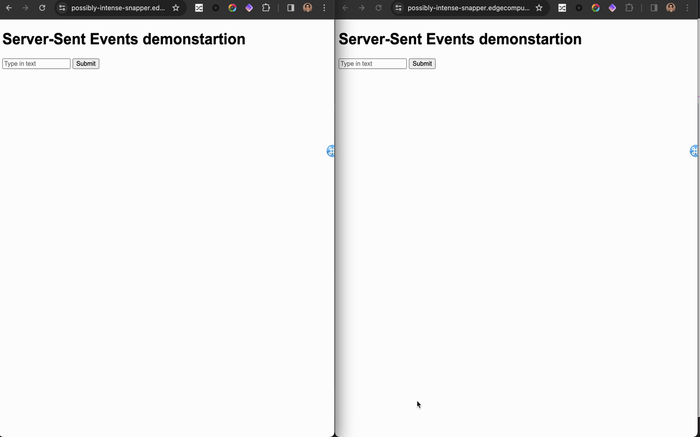

# fanout-demo

## Overview 

### Basic Expansion


### Setup 

1. Create a work directory and subdirectory called “pubiic” . 

```
mkdir -p ~/fanout_techsession/public 
```

2. Create a index.html
```
code ~/fanout_techsession/public/index.html
 - paste the index.html
```

3. change directory 

```
cd fanout_techsession
```

4. download js-static-public 

```
npx @fastly/compute-js-static-publish --public-dir=./public
```

5. change directory

```
cd compute-js
```

6. build

```
fastly compute build
```

7. Publish (Please replace the 1st domain name with yours. )

```
fastly compute publish
  * put the domain name in host setting
❯ fastly compute publish
✓ Verifying fastly.toml
✓ Identifying package name
✓ Identifying toolchain
✓ Running [scripts.build]
✓ Creating package archive
SUCCESS: Built package (pkg/compute-js-static-site.tar.gz)
✓ Verifying fastly.toml
There is no Fastly service associated with this package. To connect to an existing service add the Service ID to the fastly.toml
file, otherwise follow the prompts to create a service now.
Press ^C at any time to quit.
Create new service: [y/N] y
Service name: [compute-js-static-site]
✓ Creating service
Domain: [badly-working-starling.edgecompute.app]
Backend (hostname or IP address, or leave blank to stop adding backends): badly-working-starling.edgecompute.app
Backend port number: [443] 443
Backend name: [backend_1] self
Backend (hostname or IP address, or leave blank to stop adding backends): api.fastly.com
Backend port number: [443] 443
Backend name: [backend_2] api
Backend (hostname or IP address, or leave blank to stop adding backends):
```

7. check the index.html

```
Open the domain with your browser   
```

If you can see the index.html, please proceed to 8. 


8. Create index.js and modify index.html

```
code ~/fanout_techsession/compute-js/src/index.js
  - replace the API key with yours 
  - replace the service ID with service ID
code ~/fanout_techsession/public/index.html
- replace the service ID with service ID 
```

9. enable Fanout in the UI or API


10. fastly compute publish

```
fastly compute publish
```
